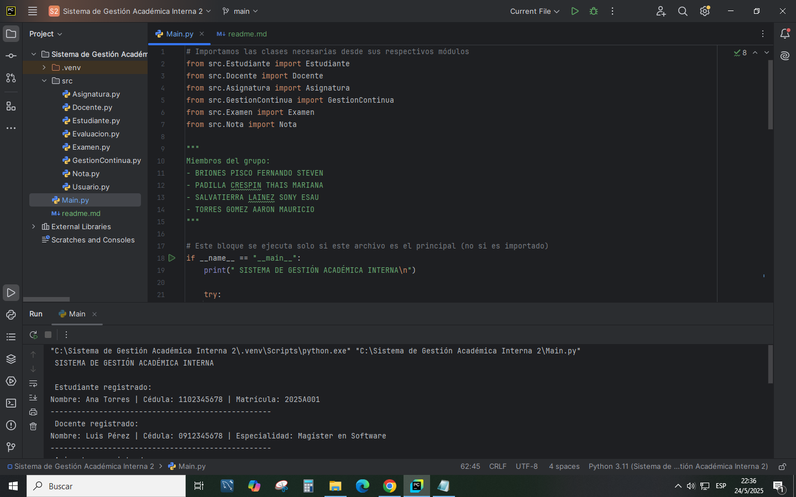
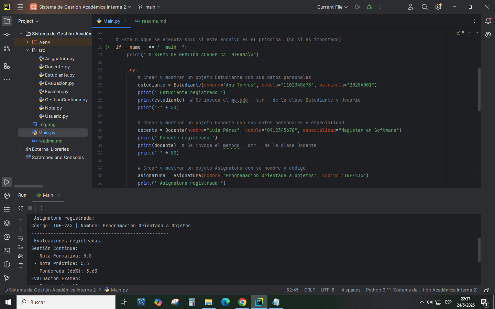
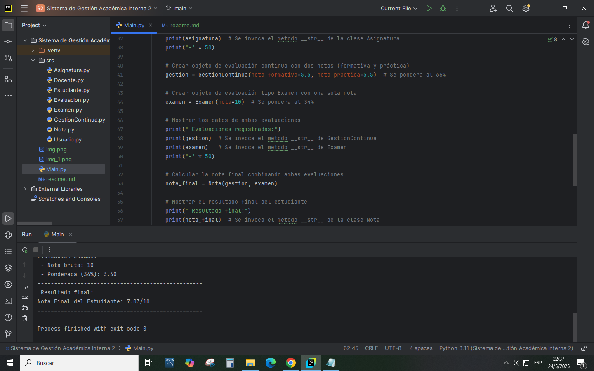

# Sistema de Gestión Académica Interna

## Descripción del Proyecto

### Integrantes del grupo

* BRIONES PISCO FERNANDO STEVEN

* PADILLA CRESPIN THAIS MARIANA

* SALVATIERRA LAINEZ SONY ESAU

* TORRES GOMEZ AARON MAURICIO
----------------------------------
Este proyecto simula un sistema de gestión académica interna desarrollado en Python aplicando los principios fundamentales de la Programación Orientada a Objetos (POO), tales como encapsulamiento, herencia y polimorfismo.

El sistema permite gestionar información de usuarios (estudiantes y docentes), asignaturas y evaluaciones con distintos tipos de cálculo de nota.

---------------------------------
**_Usuario (Clase base)_**
Clase base que representa un usuario genérico con atributos comunes como nombre y cédula. De ella heredan las clases Estudiante y Docente.

**_Estudiante (Hereda de Usuario)_**
Representa a un estudiante con atributos específicos como matrícula. Incluye validaciones mediante getters y setters.

**_Docente (Hereda de Usuario)_**
Representa a un docente con atributos adicionales como especialidad. También usa propiedades para validación y encapsulamiento.

**_Asignatura_**
Clase que modela una asignatura con nombre y código. Contiene validaciones para asegurar que los datos no estén vacíos.

**_Evaluacion (Clase base)_**
Clase base abstracta para las evaluaciones académicas. Define un atributo protegido para la nota y un método polimórfico calcularNota() que es sobrescrito por las subclases.

**_GestionContinua (Hereda de Evaluacion)_**
Representa la evaluación continua que combina notas formativa y práctica, con una ponderación del 66% sobre la nota final.

**_Examen (Hereda de Evaluacion)_**
Representa la evaluación de examen final, con una ponderación del 34% sobre la nota final.

**_Nota_**
Clase que recibe objetos de tipo GestionContinua y Examen para calcular la nota final del estudiante sumando las ponderaciones de cada evaluación.

---

## Cómo ejecutar el sistema

1. Asegúrate de tener Python 3 instalado en tu sistema.
2. Descarga o clona el repositorio en tu máquina.
3. Abre una terminal o consola y navega hasta la carpeta raíz del proyecto.
4. Ejecuta el archivo principal con el comando:

bash
python main.py

